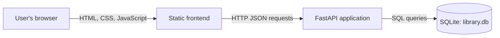

# High-Level Design

## System Overview

Little Library is a small web application for maintaining a book collection. It uses a plain HTML, CSS, and JavaScript frontend, a FastAPI backend, and SQLite for persistent storage.

## Architecture

## Components

- **Frontend:** `static/index.html` provides the page structure, `static/styles.css` provides the visual layout, and `static/app.js` manages the interface and API calls.
- **Backend:** `main.py` serves the frontend, validates request data, exposes book endpoints, and performs database operations.
- **Database:** `library.db` stores the book collection in a `books` table. The database file is created next to `main.py` when the application initializes.

## Main Request Flow

1. The browser requests `/` and receives the frontend page.
2. The frontend requests `GET /api/books` and renders the saved books.
3. Adding a book sends `POST /api/books`; FastAPI validates and saves the book.
4. Changing availability sends `PATCH /api/books/{book_id}/availability` and updates the stored value.
5. Search filters the currently loaded collection in the browser.

## Current Scope

The application supports book collection tracking and availability state. It does not currently implement library members, loans, due dates, fines, authentication, or book editing and deletion.
